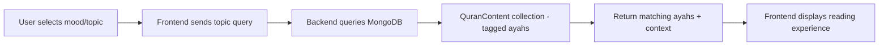
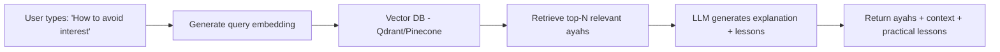
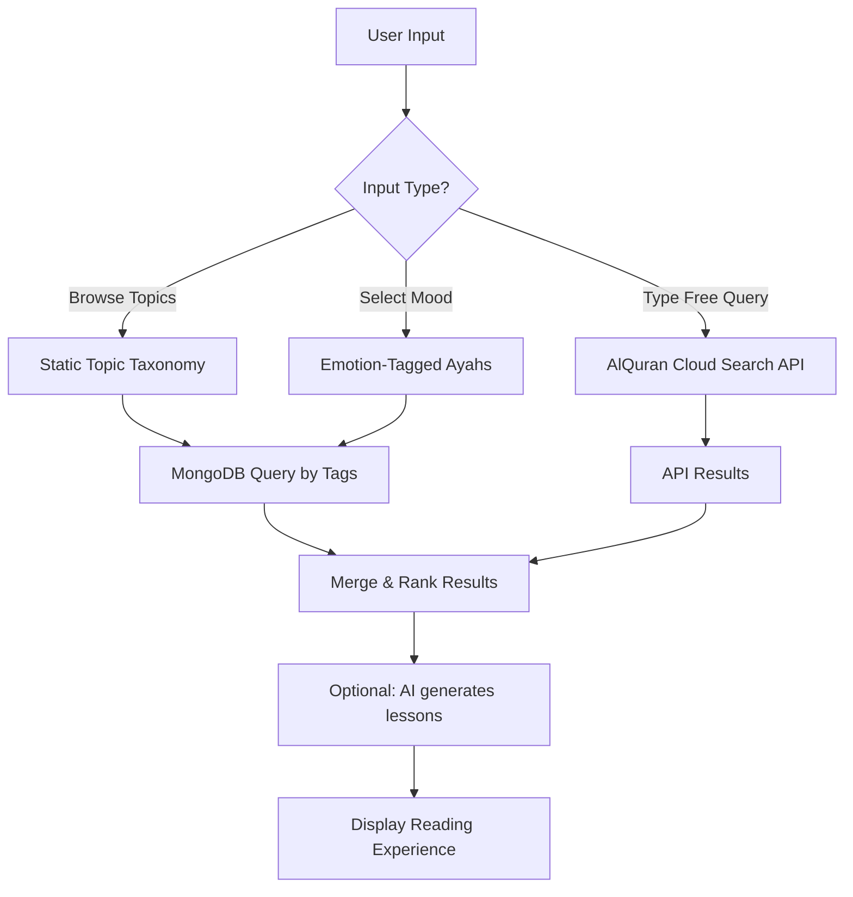
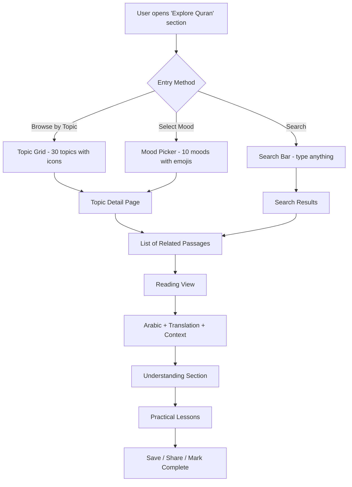

# Mood-Based & Topic-Based Quran Ayah Feature — Research Document

> **Last updated:** February 2026  
> **Purpose:** Research the best methods to build a feature where users can search and receive Quran Ayahs based on their mood, life situation, or specific topic (e.g., getting rid of interest/riba, patience, gratitude). The goal: read the relevant Quran passage, understand its meaning, and extract practical life lessons.

---

## Table of Contents

1. [Problem Statement](#1-problem-statement)
2. [Existing Apps & Solutions Analysis](#2-existing-apps--solutions-analysis)
3. [Available APIs with Topic/Theme Support](#3-available-apis-with-topictheme-support)
4. [Open-Source Datasets for Topic Tagging](#4-open-source-datasets-for-topic-tagging)
5. [Architectural Approaches (Ranked)](#5-architectural-approaches-ranked)
6. [Comprehensive Comparison Table](#6-comprehensive-comparison-table)
7. [Recommended Approach for DeenVerse](#7-recommended-approach-for-deenverse)
8. [Content Delivery & Reading Experience](#8-content-delivery--reading-experience)
9. [User Experience Flow](#9-user-experience-flow)
10. [Implementation Roadmap](#10-implementation-roadmap)

---

## 1. Problem Statement

The current Daily Learning feature shows a **single daily ayah** via rotation. Users cannot:
- Search for ayahs relevant to their **current mood** (anxious, hopeful, grateful, sad)
- Find guidance on **specific life topics** (riba/interest, marriage, anger management, patience)
- Read the **full passage context** around a relevant ayah (not just an isolated verse)
- Get **practical meaning and lessons** derived from the Quranic passage

### What We Want to Build

A feature where a user can:
1. **Select a mood or topic** → "I want guidance on avoiding riba/interest"
2. **Get relevant Quran passages** → Multiple ayahs from relevant surahs (e.g., Al-Baqarah 2:275-281)
3. **Read with full context** → Arabic text + translation + surrounding verses
4. **Understand the meaning** → Simple tafseer/context explaining why these verses were revealed
5. **Extract life lessons** → Practical action items they can apply today

---

## 2. Existing Apps & Solutions Analysis

### 2.1 Mood-Based Apps

| App | Platform | Approach | Strengths | Weaknesses |
|-----|----------|----------|-----------|------------|
| **Islamic Jar – Quran Mood Guide** | iOS/Android | Predefined mood categories (sad, angry, anxious, happy) with hand-picked verses | Simple UX, works offline, curated quality | Limited moods, no user-driven search, small verse pool |
| **Qalbi: Quran & Mood Guidance** | iOS | Mood categories (anxiety, hope, gratitude, calm, overwhelmed) + daily inspirations | Home screen widgets, daily engagement | Closed ecosystem, no API extensibility |
| **Mood App (naemakram)** | Mobile | Emotional state → curated verses for comfort & guidance | Quick to use | Static content, not expandable |
| **Quran Moods: Fill Your Heart** | Mobile | Emotion-mapped verses for spiritual connection | Focus on emotional resonance | No lessons or tafseer integration |
| **AyahMind – Quran Guidance AI** | iOS/Android | AI-powered: user types natural query → returns relevant ayahs + hadiths | Natural language input, sourced guidance | AI dependency, accuracy concerns, no reading experience |

### 2.2 Topic-Based Search Platforms

| Platform | Approach | Strengths | Weaknesses |
|----------|----------|-----------|------------|
| **Quran.com** | Keyword + ontological search (`con:` operator for concepts) | Most comprehensive, stem/root-based Arabic search, open-source | No mood-based browsing, search-heavy UX |
| **Tarteel.ai** | Voice search for verses by keyword themes (mercy, patience) | Innovative input, recitation-focused | No structured topic browsing |

### 2.3 Key Takeaways from Competitors

> [!IMPORTANT]
> **Gap in the market:** No existing app effectively combines all three: **(1) mood/topic discovery → (2) contextual reading experience → (3) practical life lessons**. Most apps stop at showing isolated verses without context or actionable takeaways. DeenVerse can own this space.

---

## 3. Available APIs with Topic/Theme Support

### 3.1 Quran Hub API (by Misraj AI) ⭐ Best for Topic Tagging

| Attribute | Detail |
|-----------|--------|
| **Base URL** | `https://api.quranhub.com/v1/` |
| **Docs** | `https://api.quranhub.com/docs` (Swagger UI) |
| **Stack** | FastAPI + PostgreSQL |
| **Auth** | To be verified (check Swagger) |

**Key endpoints for our feature:**
```
# Get all available ayah themes/topics
GET /v1/ayah-theme/themes

# Get themes for a specific ayah
GET /v1/ayah-theme/{surahId}/{ayahNumber}
```

**Why it matters:** This API provides pre-built **thematic tagging** for ayahs. Instead of building a topic taxonomy from scratch, we can consume their theme data to map ayahs to topics/moods.

**Fit for DeenVerse:** HIGH — Direct theme-to-ayah mapping. Can be used to seed our own database or as a real-time API.

---

### 3.2 RapidAPI – Quran Topics API

| Attribute | Detail |
|-----------|--------|
| **Platform** | RapidAPI marketplace |
| **Feature** | "Get all the verses about the topic" + "Get all the existing topics" |
| **Format** | JSON with Arabic + English translation + transliteration |

**Key endpoints:**
```
# List all topics
GET /topics

# Get verses by topic
GET /topics/{topicId}/verses
```

**Fit for DeenVerse:** MEDIUM — Useful as a secondary source or validation layer. RapidAPI dependency and potential rate limits.

---

### 3.3 AlQuran Cloud API (Already integrated in DeenVerse)

**Search endpoint (keyword-based):**
```
GET /v1/search/{keyword}/{surah|all}/{edition}

# Example: Search for "riba" across all surahs in English
GET /v1/search/riba/all/en.sahih
```

**Fit for DeenVerse:** HIGH — Already integrated. Can be used for keyword-based topic search as a fallback/complementary approach.

---

### 3.4 Quran.Foundation API (v4)

```
# Search verses
GET /v4/search?q={query}&language={lang}
```

**Fit for DeenVerse:** MEDIUM — Rich data (word-by-word) but requires OAuth2 setup. Better suited for advanced features in later phases.

---

## 4. Open-Source Datasets for Topic Tagging

### 4.1 Kaggle: Quranic Thematic & Emotional Annotation Dataset ⭐⭐ Best for DeenVerse

| Attribute | Detail |
|-----------|--------|
| **Source** | Kaggle (downloadable CSV) |
| **Coverage** | All 6,236 ayahs annotated |
| **Format** | CSV (convertible to JSON) |

**Columns per ayah:**

| Column | Description | Example Values |
|--------|-------------|----------------|
| `surah` | Surah number | 1, 2, 3... |
| `ayah` | Ayah number within surah | 1, 2, 3... |
| `arabic` | Original Arabic text | بسم الله الرحمن الرحيم |
| `urdu_translation` | Urdu translation | — |
| `english_translation` | English translation | — |
| `tags` | **Multi-label thematic tags** | Mercy, Faith, Justice, Guidance, Patience |
| `category` | **High-level category** | Aqeedah, Worship, Ethics, Divine Attributes, Spirituality |
| `emotion` | **Emotional tone** | Hope, Awe, Love of Allah, Gratitude, Fear, Joy |
| `context` | Situational usage | Spiritual reminder, Worship guidance, Moral teaching, Daily life |

> [!TIP]
> This dataset is **exactly what we need** for the mood-based feature. It provides:
> - **Tags** → Map to user's topic search (e.g., "riba" → finance/justice tags)
> - **Emotion** → Map to user's mood selection (anxious → Fear/Hope)
> - **Category** → Group content into browsable sections
> - **Context** → Drive the "practical lesson" aspect

**Recommended Usage:**
1. Download the CSV
2. Convert to JSON and seed into MongoDB
3. Build indexes on `tags`, `emotion`, and `category` fields
4. Query: "Give me all ayahs tagged with `Justice` + `Finance`" → returns riba-related verses

---

### 4.2 QuranicSentiment (GitHub)

| Attribute | Detail |
|-----------|--------|
| **Source** | GitHub: `QuranicSentiment` |
| **Coverage** | 6,236 verses categorized by 6 emotions |
| **Emotions** | Joyful, Peaceful, Angry, Fearful, Remorseful, Reflective |
| **Accuracy** | 89% on verse classification |

**Fit for DeenVerse:** MEDIUM — Good for emotional/mood mapping but lacks thematic topic tags. Can complement the Kaggle dataset for emotion-based queries.

---

## 5. Architectural Approaches (Ranked)

### Approach A: Static Topic Taxonomy + Database Seeding ⭐ **Recommended for MVP**



**How it works:**
1. **Seed MongoDB** with the Kaggle thematic dataset (all 6,236 ayahs with tags, emotions, categories)
2. **Build a topic taxonomy** — curate ~50 user-facing topics mapped to dataset tags:
   ```
   User Topic              → Dataset Tags
   ──────────────────────────────────────
   "Riba / Interest"       → [Justice, Finance, Prohibition]
   "Patience in hardship"  → [Patience, Faith, Sabr]
   "Marriage & family"     → [Family, Ethics, Love]
   "Anger management"      → [Ethics, Self-control, Speech]
   "Gratitude"             → [Gratitude, Worship, Blessings]
   "Death & afterlife"     → [Aqeedah, Hereafter, Accountability]
   "Anxiety & worry"       → [Hope, Trust in Allah, Tawakkul]
   ```
3. **Query by tags + emotion** to return relevant ayahs, grouped by surah for reading context
4. **Serve pre-generated lessons** (AI-generated or manually curated) for each topic

**Pros:**
- Zero external API dependency at runtime
- Instant response times
- Works offline (data is local)
- Full control over content quality

**Cons:**
- Requires initial seeding effort
- Topic taxonomy needs curation
- Static — adding new topics requires data work

---

### Approach B: AI-Powered Semantic Search (RAG) ⭐⭐ **Recommended for Phase 2**



**How it works:**
1. **Embed all ayahs** (Arabic + English translation) into vectors using an embedding model
   - Models: OpenAI `text-embedding-3-small`, Cohere `embed-multilingual-v3`, or Arabic-specific BERT
2. **Store embeddings** in a vector database (Qdrant, Pinecone, Weaviate, or PostgreSQL with pgvector)
3. **User query** → generate embedding → find nearest ayahs by cosine similarity
4. **LLM post-processing** → use retrieved ayahs as context to generate:
   - A brief explanation of why these ayahs are relevant
   - The passage context (surrounding verses)
   - Practical life lessons

**Pros:**
- Natural language search — user types anything
- Discovers non-obvious connections (semantic, not keyword)
- Scales infinitely — no manual topic curation needed
- Handles complex queries ("What does Quran say about taking loans with interest from banks?")

**Cons:**
- Requires AI infrastructure (embedding model + vector DB + LLM)
- Costs per query (embedding + LLM inference)
- Needs careful prompt engineering to avoid inaccurate interpretations
- **Must include disclaimer:** "Educational guidance, not a fatwa"

**Implementation Details:**
```javascript
// Example: RAG pipeline for Quran search
class QuranRAGService {
  constructor(vectorDB, llm) {
    this.vectorDB = vectorDB; // Qdrant or Pinecone client
    this.llm = llm;           // OpenAI or Gemini client
  }

  async searchByMoodOrTopic(userQuery) {
    // 1. Generate embedding for user's query
    const queryEmbedding = await this.llm.embeddings.create({
      model: 'text-embedding-3-small',
      input: userQuery,
    });

    // 2. Search vector DB for top 10 most similar ayahs
    const results = await this.vectorDB.search('quran_ayahs', {
      vector: queryEmbedding.data[0].embedding,
      limit: 10,
    });

    // 3. Use LLM to generate explanation and lessons
    const context = results.map(r => 
      `${r.payload.surah}:${r.payload.ayah} — ${r.payload.translation}`
    ).join('\n');

    const response = await this.llm.chat.completions.create({
      model: 'gpt-4o-mini',
      messages: [{
        role: 'system',
        content: `You are a knowledgeable Islamic educator. Given these Quranic verses 
                  relevant to the user's query, provide:
                  1. Why these verses are relevant
                  2. The core message across these verses
                  3. 2-3 practical life lessons the user can apply today
                  
                  IMPORTANT: Frame as educational guidance, not a fatwa.
                  Cite verse references in your response.`
      }, {
        role: 'user',
        content: `Query: "${userQuery}"\n\nRelevant verses:\n${context}`
      }],
      temperature: 0.4,
    });

    return {
      query: userQuery,
      ayahs: results.map(r => r.payload),
      explanation: response.choices[0].message.content,
    };
  }
}
```

---

### Approach C: Hybrid — Static Taxonomy + Keyword Search + AI Enhancement



**Best of all worlds:**
- **Browsable topics** → Curated taxonomy for common needs (fast, reliable)
- **Mood picker** → Emotion-tagged ayahs (pre-seeded data)
- **Free search** → AlQuran Cloud search API (already integrated)
- **AI layer** → Optional LLM enhancement for lessons/context

**This is the recommended overall strategy for DeenVerse.**

---

## 6. Comprehensive Comparison Table

| Criteria | A: Static Taxonomy | B: RAG/Semantic | C: Hybrid | Competitor Apps |
|----------|--------------------|-----------------|-----------|-----------------|
| **Setup Complexity** | Low | High | Medium | N/A |
| **Runtime Cost** | $0 | $0.001-0.01/query | $0-0.01/query | N/A |
| **Response Speed** | <50ms | 1-3 seconds | 50ms-2s | Varies |
| **Query Flexibility** | Limited to taxonomy | Unlimited | Medium-High | Very limited |
| **Content Quality** | High (curated) | Medium (AI) | High | Medium |
| **Offline Capable** | ✅ Yes | ❌ No | Partial | Some apps |
| **Scalability** | Need manual curation | Auto-scales | Semi-auto | Fixed |
| **Fit for DeenVerse MVP** | ⭐⭐⭐ Best | ❌ Too complex | ⭐⭐ Good | — |
| **Fit for DeenVerse v2** | Good foundation | ⭐⭐⭐ Best | ⭐⭐⭐ Best | — |

---

## 7. Recommended Approach for DeenVerse

### Phase 1 — MVP: Static Taxonomy + Emotion Tags 🎯

**Data Layer:**
1. Download Kaggle Thematic Dataset (CSV with all 6,236 ayahs tagged)
2. Create a seed script to import into MongoDB `QuranTopicContent` collection
3. Enrich with passage context (include 2-3 surrounding ayahs for each tagged verse)

**Schema:**
```javascript
const QuranTopicContentSchema = new mongoose.Schema({
  // Quran reference
  surahNumber: { type: Number, required: true },
  ayahNumber: { type: Number, required: true },
  globalAyahNumber: { type: Number, index: true },

  // Text
  arabicText: { type: String, required: true },
  englishTranslation: { type: String, required: true },
  urduTranslation: String,

  // Topic & Mood Tagging (from Kaggle dataset)
  tags: { type: [String], index: true },          // ['Mercy', 'Faith', 'Justice']
  category: { type: String, index: true },         // 'Aqeedah', 'Ethics', 'Worship'
  emotion: { type: String, index: true },           // 'Hope', 'Fear', 'Gratitude'
  context: String,                                   // 'Spiritual reminder', 'Daily life'

  // DeenVerse-specific enrichments
  userFacingTopics: { type: [String], index: true }, // ['Riba & Interest', 'Patience']
  passageAyahs: [{                                    // Surrounding verses for context
    ayahNumber: Number,
    arabicText: String,
    translation: String,
  }],
  
  // Lessons (AI-generated or manually curated)
  lesson: {
    title: String,                    // "Understanding the Prohibition of Riba"
    explanation: String,              // 2-3 sentences of context
    practicalActions: [String],       // ["Review your bank accounts...", "..."]
  },

  // Surah metadata
  surahName: String,
  surahNameArabic: String,
  revelationType: String,
});

// Compound indexes for efficient queries
QuranTopicContentSchema.index({ tags: 1, emotion: 1 });
QuranTopicContentSchema.index({ userFacingTopics: 1 });
```

**API Endpoints:**
```
# Browse available topics
GET /api/v1/quran-topics
→ Returns: [{ id, name, icon, ayahCount, description }]

# Browse available moods
GET /api/v1/quran-moods
→ Returns: [{ id, name, emoji, ayahCount }]

# Get ayahs by topic
GET /api/v1/quran-topics/:topicId/ayahs?page=1&limit=10
→ Returns: [{ ayah, arabicText, translation, lesson, passageContext }]

# Get ayahs by mood
GET /api/v1/quran-moods/:moodId/ayahs?page=1&limit=10
→ Returns: [{ ayah, arabicText, translation, lesson, passageContext }]

# Search (keyword-based, using AlQuran Cloud)
GET /api/v1/quran-search?q=riba&lang=en
→ Returns: search results with highlights
```

**User-Facing Topic Taxonomy (MVP — ~30 topics):**

| Category | Topics |
|----------|--------|
| **Faith & Belief** | Tawheed (Oneness of Allah), Belief in the Hereafter, Trust in Allah (Tawakkul) |
| **Worship** | Prayer (Salah), Fasting (Sawm), Charity (Sadaqah/Zakat), Hajj |
| **Character** | Patience (Sabr), Gratitude (Shukr), Humility, Truthfulness, Forgiveness |
| **Social** | Family & Marriage, Parents, Neighbors, Community, Justice |
| **Finance** | Riba / Interest, Honest Trade, Wealth & Provision, Charity |
| **Emotions** | Anxiety & Worry, Grief & Sadness, Anger Management, Hope & Optimism |
| **Life Guidance** | Death & Afterlife, Repentance (Tawbah), Knowledge & Learning, Purpose of Life |
| **Prohibitions** | Alcohol & Intoxicants, Backbiting & Gossip, Fraud & Deception |

**Mood Picker (MVP — ~10 moods):**

| Mood | Emoji | Mapped Emotions | Example Topics |
|------|-------|-----------------|----------------|
| Anxious / Worried | 😰 | Fear, Concern | Tawakkul, Provision |
| Sad / Grieving | 😢 | Grief, Loss | Patience, Hope |
| Grateful | 🤲 | Gratitude, Joy | Blessings, Shukr |
| Angry / Frustrated | 😤 | Anger, Injustice | Patience, Forgiveness |
| Hopeful | 🌅 | Hope, Optimism | Mercy, Future |
| Lost / Confused | 🤔 | Reflection, Searching | Guidance, Purpose |
| Peaceful | 😌 | Peace, Serenity | Dhikr, Contentment |
| Motivated | 💪 | Determination, Strength | Jihad of self, Goals |
| Guilty / Seeking Repentance | 🙏 | Remorse, Regret | Tawbah, Forgiveness |
| Lonely | 💔 | Isolation, Longing | Allah's nearness, Community |

---

### Phase 2A — Smart Fuzzy Search (Lite) ✅ IMPLEMENTED

Client-side fuzzy search using **Fuse.js** — zero API keys, zero cost, instant results, works offline.

1. **Installed Fuse.js** on the frontend (~5KB gzipped)
2. **Created `useSmartSearch.ts` hook** — builds Fuse.js indexes from loaded topics/moods data
3. **Upgraded `SearchBar.tsx`** — real-time fuzzy dropdown as user types, matching across:
   - Topic names, Arabic names, descriptions, categories
   - Mood names and descriptions
4. **Dropdown UI** — shows matched topics (with icons + category badges) and moods (with emojis)
5. **Fallback** — "Search full Quran text" option triggers existing AlQuran Cloud keyword search
6. **Navigation** — clicking a dropdown result navigates to the topic/mood detail page

**Files created/modified:**
- `frontend/src/features/quran-topics/useSmartSearch.ts` — Fuse.js hook
- `frontend/src/features/quran-topics/components/SearchBar.tsx` — upgraded with dropdown
- `frontend/src/features/quran-topics/QuranTopicsPage.tsx` — wired smart search

---

### Phase 2B — AI Enhancement (Future — Requires API Keys)

1. **Embed all ayahs** into a vector store for semantic search
2. **Add natural language search** — "What does Quran say about avoiding bank interest?"
3. **AI-generated lessons** — Use LLM to create contextual explanations per query
4. **Personalization** — Track which topics a user engages with, recommend related content

---

## 8. Content Delivery & Reading Experience

> [!IMPORTANT]
> The reading experience is what differentiates DeenVerse from competitors. Don't just show isolated verses — show the **passage** with context.

### 8.1 Reading View Structure

For each topic/mood result, display:

```
┌─────────────────────────────────────────────────────┐
│  📖 Topic: Riba & Interest                          │
│  Based on: Surah Al-Baqarah (2:275-281)             │
├─────────────────────────────────────────────────────┤
│                                                     │
│  ═══ THE PASSAGE ═══                                │
│                                                     │
│  [Arabic text of 2:275]                 ← Primary   │
│  "Those who consume interest..."        ← Transl.   │
│                                                     │
│  [Arabic text of 2:276]                             │
│  "Allah destroys interest and..."                   │
│                                                     │
│  [Arabic text of 2:277]                             │
│  "Indeed, those who believe and do..."              │
│                                                     │
│  ... (full passage)                                 │
│                                                     │
├─────────────────────────────────────────────────────┤
│  📚 UNDERSTANDING                                   │
│                                                     │
│  These verses were revealed in Madinah when the     │
│  Muslim community was establishing financial        │
│  principles. The passage clearly prohibits riba     │
│  (interest/usury) and contrasts it with charity...  │
│                                                     │
├─────────────────────────────────────────────────────┤
│  ✅ LESSONS FOR TODAY                               │
│                                                     │
│  1. Review your financial accounts — are any        │
│     earning or paying interest?                     │
│  2. Explore Islamic banking alternatives for        │
│     savings and loans                               │
│  3. Replace interest income with charity            │
│     (sadaqah) — even a small amount                 │
│                                                     │
├─────────────────────────────────────────────────────┤
│  [💾 Save] [📤 Share] [✅ Completed]                │
└─────────────────────────────────────────────────────┘
```

### 8.2 Content Sources for "Understanding" Section

| Source | How to Use | Complexity |
|--------|-----------|------------|
| **AI-generated** (GPT/Gemini) | Pre-generate context for each topic cluster | Low cost, scalable |
| **Tafsir APIs** | AlQuran Cloud has tafsir editions (e.g., `en.maududi`) | API call per ayah |
| **Manual curation** | Scholar-reviewed content for top 30 topics | Highest quality, highest effort |
| **Quran Hub API** | May provide thematic context per ayah | Check availability |

**Recommendation for MVP:** Pre-generate using AI for all ~30 topics, then manually review for accuracy before publishing.

---

## 9. User Experience Flow



### Entry Points

1. **From Daily Learning tab** → "Explore more on this topic" link after daily ayah
2. **From Learn Quran Hub** → Dedicated "Quran by Topic" / "Quran by Mood" cards
3. **From global search** → Results filtered to Quran content

---

## 10. Implementation Roadmap

### Phase 1 — MVP (Estimated: 1-2 weeks)

| Step | Task | Priority |
|------|------|----------|
| 1 | Download Kaggle Thematic Dataset | P0 |
| 2 | Create MongoDB seed script (`scripts/seedQuranTopics.js`) | P0 |
| 3 | Define `QuranTopicContent` Mongoose model | P0 |
| 4 | Create 30 user-facing topic definitions with icons | P0 |
| 5 | Build API: `GET /quran-topics`, `GET /quran-topics/:id/ayahs` | P0 |
| 6 | Build API: `GET /quran-moods`, `GET /quran-moods/:id/ayahs` | P0 |
| 7 | Pre-generate "Understanding" + "Lessons" for top 30 topics using AI | P1 |
| 8 | Build frontend: Topic browse grid | P0 |
| 9 | Build frontend: Mood picker | P0 |
| 10 | Build frontend: Reading view (passage + understanding + lessons) | P0 |
| 11 | Integrate keyword search via AlQuran Cloud API | P1 |
| 12 | Add "Save" and "Mark Complete" functionality | P2 |

### Phase 2A — Smart Fuzzy Search (Lite) ✅ COMPLETED

| Step | Task | Status |
|------|------|--------|
| 1 | Install Fuse.js on frontend | ✅ Done |
| 2 | Create `useSmartSearch.ts` hook (Fuse.js indexes on topics + moods) | ✅ Done |
| 3 | Upgrade `SearchBar.tsx` with real-time fuzzy dropdown | ✅ Done |
| 4 | Wire smart search into `QuranTopicsPage.tsx` | ✅ Done |
| 5 | Fall back to AlQuran Cloud keyword search for full Quran text | ✅ Done |

### Phase 2B — AI Enhancement (Future — Estimated: 2-3 weeks)

| Step | Task | Priority |
|------|------|----------|
| 1 | Set up vector database (Qdrant or pgvector) | P0 |
| 2 | Embed all 6,236 ayahs using OpenAI embeddings | P0 |
| 3 | Build semantic search endpoint | P0 |
| 4 | Add natural language search UI | P0 |
| 5 | Implement real-time AI lesson generation | P1 |
| 6 | Add user engagement tracking (which topics, completion rates) | P1 |
| 7 | Build personalized recommendations | P2 |

### Phase 3 — Community & Depth ✅ IMPLEMENTED (Backend + Frontend)

*Note: Phase 3 backend APIs are now integrated with the frontend for reflections, tafsir/audio enrichment, and spaced repetition progress. Scholar verification currently supports display fields in the reflection schema/response, while scholar moderation workflows are still pending.*

| Step | Task | Backend Status |
|------|------|----------|
| 1 | Community reflections per topic (user-submitted insights) | ✅ Done |
| 2 | Scholar-verified content badges | 🟡 Partial (schema/display ready; verification workflow pending) |
| 3 | Tafsir integration for deeper understanding | ✅ Done |
| 4 | Audio recitation for passages | ✅ Done |
| 5 | Spaced repetition for revisiting topics | ✅ Done |

---

## Appendix A: Data Sources Summary

| Source | Type | Coverage | License | Best For |
|--------|------|----------|---------|----------|
| **Kaggle Thematic Dataset** | CSV dataset | 6,236 ayahs, tags + emotions + categories | Open | Topic/mood tagging — seed DB |
| **QuranicSentiment (GitHub)** | JSON dataset | 6,236 verses, 6 emotions | Open | Emotion classification supplement |
| **Quran Hub API** | REST API | Theme endpoints per ayah | Free (verify) | Real-time theme lookup |
| **AlQuran Cloud API** | REST API | Full Quran, search, 100+ editions | Free, no auth | Text + translation + search |
| **quran-meta (NPM)** | Package | Metadata utilities | MIT | Ayah ↔ Juz/Ruku mapping |
| **quran-json (NPM)** | Static JSON | Full text + 10 translations, CDN-ready | CC-BY-SA | Seeding text data |

## Appendix B: Key References

- **Kaggle Thematic Dataset:** Search "Quranic Thematic Emotional Annotation Dataset" on Kaggle
- **QuranicSentiment:** `github.com/QuranicSentiment`
- **Quran Hub API Docs:** `api.quranhub.com/docs`
- **AlQuran Cloud API:** `api.alquran.cloud/v1/`
- **quran-meta NPM:** `npmjs.com/package/quran-meta`
- **quran-json NPM:** `npmjs.com/package/quran-json`

## Appendix C: Disclaimer Template

> [!CAUTION]
> All AI-generated content (explanations, lessons, mood mappings) **must** include this disclaimer in the UI:
> 
> *"This content is for educational purposes and general spiritual reflection. It is not a fatwa or religious ruling. For specific Islamic rulings, please consult a qualified scholar."*
