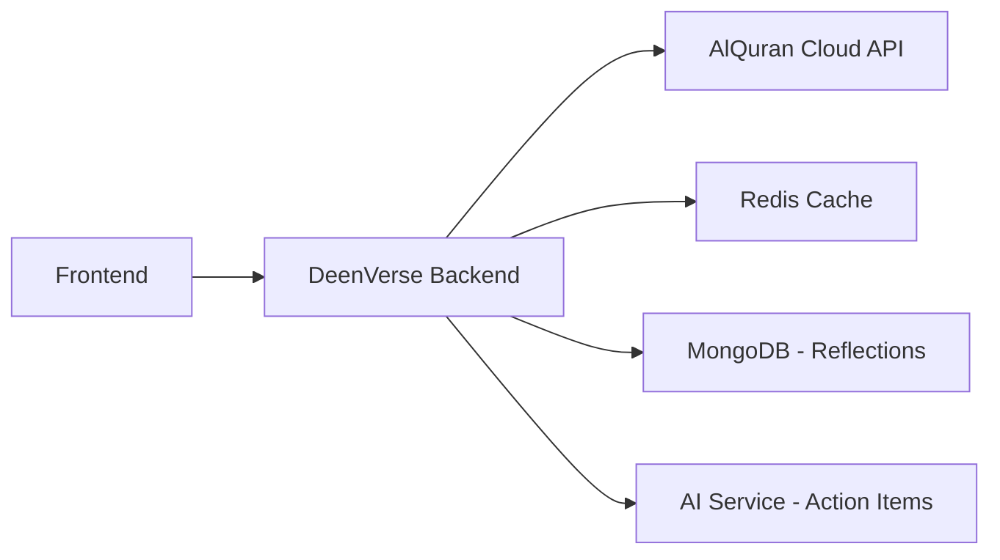
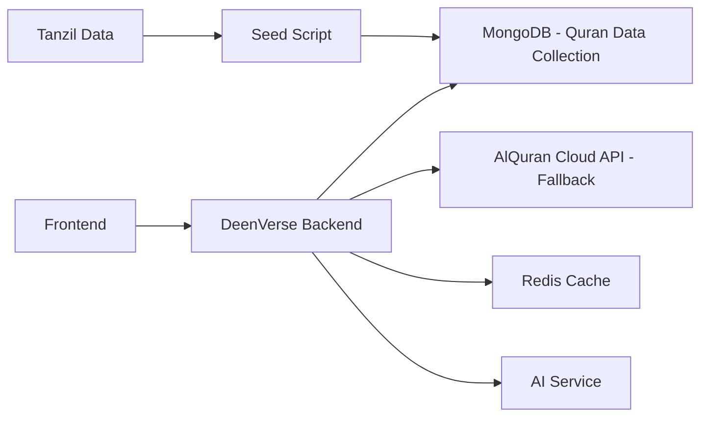

# Quran Data Sources & Dynamic Action Items — Research Document

> **Last verified:** February 2026 — All APIs and packages below were tested against live endpoints.

## Overview

The DeenVerse Daily Learning feature currently uses **hardcoded content** in `dailyLearningController.js` — only 2 Ayahs, 1 Ruku, 1 Juzz, and 1 Para entry. This document provides a comprehensive research analysis of authentic data sources, APIs, and architectural strategies to replace this with a scalable, dynamic system that can serve **6,236 Ayahs**, **556 Rukus**, **30 Juzz (Para)**, and dynamically generated action items.

---

## Part 1: Quran Data — Numbers at a Glance

| Division       | Count   | Description | Verified Source |
|----------------|---------|-------------|-----------------|
| **Ayah**       | 6,236   | Individual verses (Hafs riwaya) | AlQuran Cloud `/v1/meta` ✅ |
| **Surah**      | 114     | Chapters | AlQuran Cloud `/v1/meta` ✅ |
| **Ruku**       | 556     | Thematic paragraph sections within Surahs (marked with ع) | AlQuran Cloud `/v1/meta` ✅ |
| **Juzz**       | 30      | Equal-length divisions for monthly reading | AlQuran Cloud `/v1/meta` ✅ |
| **Para**       | 30      | Same as Juzz (South Asian terminology) | — |
| **Hizb**       | 60      | Half-Juzz divisions | AlQuran Cloud `/v1/meta` ✅ |
| **Hizb Quarter**| 240    | Quarter-Hizb divisions (Rub al-Hizb ۞) | AlQuran Cloud `/v1/meta` ✅ |
| **Manzil**     | 7       | Weekly reading divisions | AlQuran Cloud `/v1/meta` ✅ |
| **Page**       | 604     | Medina Mushaf pages (15-line) | AlQuran Cloud `/v1/meta` ✅ |
| **Sajda**      | 15      | Prostration verses (4 obligatory, 11 recommended) | AlQuran Cloud `/v1/meta` ✅ |

> [!NOTE]
> **Juzz and Para are the same thing.** "Juzz" is the Arabic term, "Para" (also called "Sipara") is the Urdu/South Asian term. Both refer to the 30 equal divisions of the Quran. In the UI, you can use both tabs but they map to the same data.

### Ruku Count Clarification
The count varies by riwaya (recitation tradition):
- **Hafs (most common worldwide):** 556 rukus — confirmed via AlQuran Cloud API metadata
- **Qalun:** May differ slightly
- **quran-meta NPM package (v6.0.17):** Reports 558 rukus for some riwayas

DeenVerse should use **556** (Hafs) as the primary count since it's the dominant riwaya globally.

---

## Part 2: Authentic Data Sources — Ranked Recommendations

### 🏆 Tier 1: Primary Recommended Sources

#### 1. AlQuran Cloud API ⭐ (Best for DeenVerse)

| Attribute       | Detail |
|-----------------|--------|
| **Base URL**    | `https://api.alquran.cloud/v1/` |
| **Auth**        | None required (free, open) |
| **Rate Limit**  | Generous (no documented limit) |
| **Format**      | JSON |
| **Reliability** | High — community maintained, multiple mirror domains |

**Why it's the best fit for DeenVerse:**
- ✅ No API key required — zero friction
- ✅ Has **dedicated endpoints** for every Quran division we need
- ✅ Supports 100+ editions (translations, audio, tafsir)
- ✅ Supports search across editions
- ✅ Supports offset/limit pagination

**Complete Endpoint Map:**

```
# Ayah (individual verse)
GET /v1/ayah/{number}                        # By global number (1–6236)
GET /v1/ayah/{surah}:{ayah}/{edition}        # By reference e.g. 2:255/en.asad

# Surah (chapter)
GET /v1/surah                                # List all 114 surahs
GET /v1/surah/{number}/{edition}             # Get full surah text

# Juzz / Para (30 equal divisions)  
GET /v1/juz/{number}/{edition}               # number = 1–30
GET /v1/juz/{number}/{edition}?offset=3&limit=10

# Ruku (thematic sections)
GET /v1/ruku/{number}/{edition}              # number = 1–556
GET /v1/ruku/{number}/{edition}?offset=3&limit=3

# Page (Medina Mushaf)
GET /v1/page/{number}/{edition}              # number = 1–604

# Manzil (weekly divisions)  
GET /v1/manzil/{number}/{edition}            # number = 1–7

# Hizb Quarter
GET /v1/hizbQuarter/{number}/{edition}       # number = 1–240

# Search
GET /v1/search/{keyword}/{surah|all}/{edition}

# Metadata
GET /v1/meta                                 # Full Quran metadata

# Sajda (prostration verses)
GET /v1/sajda/{edition}

# Multiple editions at once
GET /v1/ayah/{number}/editions/{ed1},{ed2},{ed3}
```

**Example: Fetching Ruku 7 with English translation:**
```
GET https://api.alquran.cloud/v1/ruku/7/en.asad
```

**Example: Fetching Juzz/Para 30 in Arabic + English:**
```
GET https://api.alquran.cloud/v1/juz/30/editions/quran-uthmani,en.asad
```

**Popular Edition Identifiers:**
| Edition ID | Description |
|------------|-------------|
| `quran-uthmani` | Arabic Uthmani script |
| `quran-simple` | Arabic simple script |
| `en.asad` | Muhammad Asad (English) |
| `en.sahih` | Saheeh International (English) |
| `en.pickthall` | Marmaduke Pickthall (English) |
| `ur.jalandhry` | Fateh Muhammad Jalandhry (Urdu) |
| `ar.alafasy` | Mishary Al-Afasy audio |

---

#### 2. Quran.Foundation Content API (v4)

| Attribute       | Detail |
|-----------------|--------|
| **Base URL**    | `https://api.quran.com/api/v4/` |
| **Auth**        | OAuth2 (`client_credentials`) — requires `x-auth-token` and `x-client-id` headers |
| **Format**      | JSON |
| **Bonus**       | Word-by-word data, multiple script types |

**Endpoints:**
```
GET /v4/chapters                             # List all chapters
GET /v4/verses/by_chapter/{id}               # Verses by Surah
GET /v4/verses/by_juz/{juz_number}          # Verses by Juzz (1–30)
GET /v4/verses/by_ruku/{ruku_number}        # Verses by Ruku (1–558)
GET /v4/verses/by_page/{page_number}        # Verses by Page
GET /v4/verses/by_hizb/{hizb_number}        # Verses by Hizb
GET /v4/juzs                                 # List all 30 Juzs with verse mappings
```

**Pros:** Richer metadata (word-by-word, transliteration), powers quran.com  
**Cons:** Requires authentication setup, more complex integration

> [!IMPORTANT]
> This API is production-grade and powers Quran.com. However, it requires OAuth2 setup. For MVP, AlQuran Cloud is simpler. Consider migrating to this for advanced features like word-by-word rendering.

---

### 🥈 Tier 2: Offline/Static Data Sources

#### 3. Tanzil.net — Downloadable Quran Data

| Attribute       | Detail |
|-----------------|--------|
| **URL**         | `https://tanzil.net/download/` |
| **Formats**     | Plain text, XML, SQL (MySQL dump) |
| **Metadata**    | Separate `quran-data.xml` / `quran-data.js` file |

**Metadata includes:** Surah info, Juz boundaries, Hizb/Hizb quarter, Manzil, Ruku (556 sections), Page numbers (Medina Mushaf), Sajda locations, revelation order.

**Best for:** Seeding your own database, offline access, reducing API dependency.

**Strategy:** Download Tanzil data → import into MongoDB → serve from your own backend.

---

#### 4. `quran-meta` NPM Package ⭐⭐ (Best for Metadata Layer)

| Attribute       | Detail |
|-----------------|--------|
| **NPM**         | `npm install quran-meta` (v6.0.17, published Feb 2026) |
| **GitHub**      | `github.com/quran-center/quran-meta` |
| **Methods**     | 40+ utility functions |
| **Size**        | 1.7 MB unpacked, zero dependencies |
| **License**     | MIT |
| **Module**      | ESM + CJS + IIFE — works in both Node.js and browser |

> **Verification Status:** ✅ Confirmed active — last published 8 days ago (as of Feb 2026). 466 weekly downloads. 100% unit test covered with data correctness validation against multiple sources (Tanzil, AlQuran Cloud, KFGQPC fonts).

**Why this is critical for DeenVerse:**
This package is the **single best utility layer** for mapping between Quran divisions without making API calls. It directly answers: "Given ayah X, which Juz/Ruku/Page/Hizb is it in?" — which is exactly what the Daily Learning feature needs.

**Multi-Riwaya Support:**
- **Hafs** (default, most common globally) — Ready
- **Qalun** (parts of North Africa) — Ready, includes Thumun al-Hizb (480 divisions)
- **Warsh** (West/North Africa) — Ready
- Custom riwaya instances supported for any data

**Tree-Shakeable Imports (Recommended for DeenVerse):**
```javascript
// Only bundles Hafs data (~50% smaller than importing everything)
import { getAyahMeta, findJuz, meta, quran } from 'quran-meta/hafs';

console.log(`Total ayahs: ${meta.numAyahs}`);     // 6236
console.log(`Total surahs: ${meta.numSurahs}`);    // 114
console.log(`Total juzs: ${meta.numJuzs}`);        // 30
console.log(`Total pages: ${meta.numPages}`);       // 604
```

**Key Functions for Daily Learning Feature:**
```javascript
import { 
  getAyahMeta,           // Get full metadata for any ayah
  getSurahMeta,          // Get surah info (name, ayah count, revelation type)
  findJuz,               // Find which Juz a surah:ayah belongs to
  findPage,              // Find which Page a surah:ayah is on
  isAyahJuzFirst,        // Is this ayah the first in its Juz?
  nextAyah,              // Navigate to next ayah
  prevAyah,              // Navigate to previous ayah
  findAyahIdBySurah,     // Convert surah:ayah → global ayah ID (1-6236)
  findSurahByAyahId,     // Convert global ayah ID → [surah, ayah]
  findRangeAroundAyah,   // Find context ayahs around a given ayah
  meta                   // Access all constants (numAyahs, numSurahs, etc.)
} from 'quran-meta/hafs';

// Example: Get everything about Al-Baqarah:255 (Ayat al-Kursi)
const ayahInfo = getAyahMeta(findAyahIdBySurah(2, 255));
// Returns: { surah: 2, ayah: 255, juz: 3, page: 42, ... }

// Example: Get surah info
const surahInfo = getSurahMeta(2);
// Returns: { name: 'البَقَرَة', ayahCount: 286, ... }

// Example: Find Juz for daily rotation
const juzNumber = findJuz(2, 142); // → 2

// Example: Convert global ayah to surah:ayah
const [surah, ayah] = findSurahByAyahId(262); // → [2, 255]
```

**Class-Based API (For multiple riwaya support):**
```javascript
import { QuranRiwaya } from 'quran-meta';

const hafs = QuranRiwaya.hafs();
const surahMeta = hafs.getSurahMeta(2);
console.log(surahMeta.name);       // 'البَقَرَة'
console.log(surahMeta.ayahCount);  // 286

const juz = hafs.findJuz(2, 1);   // → 1
const isFirst = hafs.isAyahJuzFirst(149); // → 2 (it's the first ayah of Juz 2)
```

**Data Correctness:** The package cross-validates its data against:
- AlQuran Cloud API metadata (`/v1/meta`)
- Tanzil.net metadata (`quran-data.js`)
- Quran API metadata
- KFGQPC Hafs, Sousi, Douri, Qaloun, Shuba, Warsh font data from the King Fahd Complex

**Best for:** Utility/helper layer — mapping between ayah ↔ juz ↔ ruku ↔ page without API calls. Use this in the backend to calculate which content to show based on daily rotation without needing external HTTP requests.

---

#### 5. `quran-json` NPM Package (CDN-Ready Static Data)

| Attribute       | Detail |
|-----------------|--------|
| **NPM**         | `npm install quran-json` (v3.1.2) |
| **GitHub**      | `github.com/risan/quran-json` (516 stars) |
| **License**     | CC-BY-SA-4.0 |
| **Text Source**  | Uthmani text from The Noble Qur'an Encyclopedia |

**What it offers:**
- Complete Quran text (Uthmani script) + transliteration in JSON
- **10 translations:** Bengali, Chinese, English (Saheeh International), Spanish, French, Indonesian, Russian, Swedish, Turkish, Urdu
- Per-verse JSON files (1–6236) with all translations
- Per-chapter JSON files (1–114)
- Available via **jsDelivr CDN** — no server needed

**CDN URLs (verified):**
```
# Full Quran (Arabic only)
https://cdn.jsdelivr.net/npm/quran-json@3.1.2/dist/quran.json

# Full Quran + English translation
https://cdn.jsdelivr.net/npm/quran-json@3.1.2/dist/quran_en.json

# Full Quran + Urdu translation
https://cdn.jsdelivr.net/npm/quran-json@3.1.2/dist/quran_ur.json

# Single chapter (e.g., Al-Fatiha with English)
https://cdn.jsdelivr.net/npm/quran-json@3.1.2/dist/chapters/en/1.json

# Single verse (e.g., verse 1 with all translations)
https://cdn.jsdelivr.net/npm/quran-json@3.1.2/dist/verses/1.json
```

**Best for:** Seeding MongoDB with all verse text and translations in one bulk import. Combine with `quran-meta` for structural metadata (juz/ruku/page boundaries).

---

### 🥉 Tier 3: Additional GitHub Repositories

| Repository | Stars | What it provides | Verified |
|-----------|-------|-----------------|---------|
| `semarketir/quranjson` | — | Full Quran JSON with `juz.json` + `surah.json` + audio index + translations | ✅ Active |
| `risan/quran-json` | 516 | Complete Quran text + 10 translations in JSON, CDN-ready | ✅ Active |
| `quran-center/quran-meta` | — | 40+ metadata utility functions, multi-riwaya, TypeScript | ✅ Active (Feb 2026) |

> [!NOTE]
> `hamzakat/madani-muhsaf-json` and `rzkytmgr/quran-api` were referenced in earlier research but could not be verified as actively maintained. Prefer the sources above.

---

## Part 3: Recommended Architecture for DeenVerse

### Option A: API-First (Recommended for MVP) 🚀



**How it works:**
1. Frontend requests `/api/v1/daily-learning?type=ayah`
2. Backend picks today's content index (day-of-year rotation across full dataset)
3. Backend fetches Arabic text + translation from AlQuran Cloud API
4. Backend generates dynamic action item via AI service (or picks from pre-generated pool)
5. Response is cached in Redis for 24 hours
6. User reflections are saved to MongoDB

**Implementation Steps:**
```javascript
// 1. Create a QuranService that wraps the AlQuran Cloud API
class QuranService {
  constructor() {
    this.baseUrl = 'https://api.alquran.cloud/v1';
    this.arabicEdition = 'quran-uthmani';
    this.translationEdition = 'en.sahih';
  }

  async getAyah(surahNum, ayahNum) {
    const [arabic, translation] = await Promise.all([
      fetch(`${this.baseUrl}/ayah/${surahNum}:${ayahNum}/${this.arabicEdition}`),
      fetch(`${this.baseUrl}/ayah/${surahNum}:${ayahNum}/${this.translationEdition}`)
    ]);
    return { arabic: arabic.data, translation: translation.data };
  }

  async getRuku(rukuNum) {
    return fetch(`${this.baseUrl}/ruku/${rukuNum}/editions/${this.arabicEdition},${this.translationEdition}`);
  }

  async getJuz(juzNum) {
    return fetch(`${this.baseUrl}/juz/${juzNum}/editions/${this.arabicEdition},${this.translationEdition}`);
  }
}
```

### Option B: Hybrid (Static Data + API) — Best Long-Term ⚡



**How it works:**
1. **One-time seed:** Download Tanzil XML data → run a seed script → populate MongoDB with all 6,236 ayahs + metadata (surah, juz, ruku, page, hizb, manzil)
2. **Runtime:** Backend queries its own MongoDB — zero external API dependency
3. **Fallback:** If data is missing, fallback to AlQuran Cloud API
4. **Action Items:** AI-generated or pre-computed pool

**Advantages:** No rate limits, no external dependency, instant response times, works offline.

---

## Part 4: Dynamic Action Items — Replacing Hardcoded Values

### The Problem
Currently, each content entry has a manually written `actionItem` string:
```javascript
actionItem: "Set a timer for 2 minutes right now. Close your eyes, breathe..."
```
This doesn't scale to 6,236+ verses.

### Solution Strategies (Ranked)

#### Strategy 1: AI-Generated (LLM Template) — Recommended ⭐

Use an LLM (OpenAI GPT, Google Gemini, or similar) with carefully crafted prompt templates to generate action items on-the-fly or in bulk pre-generation.

**Prompt Template:**
```
You are a kind, practical Islamic spiritual guide. Given the following Quran verse, 
generate a short, actionable reflection prompt that a Muslim can apply TODAY in 
their daily life.

Rules:
- Keep it under 2 sentences
- Make it specific and practical (not vague "be better")
- Frame as a question OR a simple challenge
- Do NOT give religious rulings or fatwas
- Keep tone warm, encouraging, personal
- Reference the verse's core theme

Verse: {arabic_text}
Translation: {translation_text}
Surah: {surah_name} ({surah_number}:{ayah_number})
Theme: {optional_theme_tag}

Generate:
1. A short title (3-5 words)
2. A brief context paragraph (2-3 sentences connecting the verse to daily life)
3. An action item (1-2 sentences, practical and immediate)
```

**Implementation:**
```javascript
// services/actionItemService.js
import OpenAI from 'openai';

class ActionItemService {
  constructor() {
    this.openai = new OpenAI({ apiKey: process.env.OPENAI_API_KEY });
  }

  async generateActionItem(ayahData) {
    const prompt = `You are a kind, practical Islamic spiritual guide...`; // template above
    
    const response = await this.openai.chat.completions.create({
      model: 'gpt-4o-mini', // cost-effective
      messages: [{ role: 'user', content: prompt }],
      temperature: 0.7,
      max_tokens: 300,
    });
    
    return this.parseResponse(response.choices[0].message.content);
  }
}
```

**Cost estimate:** GPT-4o-mini at ~$0.15/1M input tokens → generating all 6,236 action items costs < $1.

---

#### Strategy 2: Pre-generated Pool with Theme Tags

Generate all action items in advance using the LLM, store them in a JSON file or MongoDB collection, and serve from cache.

**Workflow:**


**Schema for pre-generated content:**
```javascript
const QuranContentSchema = new mongoose.Schema({
  // Quran reference
  surahNumber: Number,
  ayahNumber: Number,
  globalAyahNumber: Number,     // 1–6236
  juzNumber: Number,            // 1–30
  rukuNumber: Number,           // 1–556
  pageNumber: Number,           // 1–604

  // Text
  arabicText: String,           // Uthmani script
  translationText: String,      // English translation

  // AI-generated content
  title: String,                // "Finding true peace"
  context: String,              // 2-3 sentence contextual bridge
  actionItem: String,           // Practical prompt
  
  // Metadata
  themeTags: [String],          // ['patience', 'gratitude', 'family']
  surahName: String,
  surahNameArabic: String,
  revelationType: String,       // 'Meccan' or 'Medinan'
});
```

---

#### Strategy 3: Theme-Based Template Library (No AI Required)

Create a library of ~50 generic action item templates tagged by theme, then map each ayah to a theme and fill in the template.

**Theme → Template Map:**
```javascript
const actionTemplates = {
  patience: [
    "Identify one situation today where you can practice sabr instead of reacting immediately.",
    "When you feel frustrated today, pause and say 'HasbunAllahu wa ni'mal wakeel' before responding.",
  ],
  gratitude: [
    "Write down 3 specific blessings from yesterday that you might have overlooked.",
    "Send a thank-you message to someone who helped you recently — no matter how small.",
  ],
  tawakkul: [
    "What is one outcome you're anxious about? Write it down, make dua, and consciously let go.",
    "Replace one 'I hope...' thought today with 'I trust Allah's plan for...'",
  ],
  family: [
    "Call or message one family member today just to check in and show love.",
    "Do one small act of service for your family today without being asked.",
  ],
  speech: [
    "Before speaking today, pause and ask: 'Is this necessary? Is it kind? Is it true?'",
    "Avoid one conversation today that typically leads to gossip or complaint.",
  ],
  charity: [
    "Find one opportunity today to give — whether it's money, time, or a kind word.",
    "Set aside a small amount for sadaqah before you spend on anything else today.",
  ],
  prayer: [
    "Add one extra minute of dua after your next salah — talk to Allah about your day.",
    "Pray your next salah with full khushoo — put your phone in another room.",
  ],
};
```

> [!TIP]
> **Hybrid approach is best:** Use Strategy 2 (pre-generate a full pool using AI) and fall back to Strategy 3 (template library) for any missing entries. Strategy 1 (real-time AI) can be used for premium features like personalized reflections.

---

## Part 5: Content Rotation Logic

Replace the current simple `dayOfYear % array.length` with smarter rotation:

```javascript
// services/contentRotation.js

function getContentIndex(type, date = new Date()) {
  const dayOfYear = getDayOfYear(date);
  
  const totals = {
    ayah: 6236,   // Total ayahs in the Quran
    ruku: 556,    // Total rukus
    juzz: 30,     // Total juzz/para
    para: 30,     // Same as juzz
  };
  
  // Rotate through the full corpus over the year
  return dayOfYear % totals[type];
}

// For ayah: index gives global ayah number (1-6236)
// For ruku: index gives ruku number (1-556)
// For juzz/para: index gives juzz number (1-30)
```

**Advanced rotation:** Use a deterministic shuffle based on year so users don't see the same sequence every year:
```javascript
function getShuffledIndex(type, date) {
  const year = date.getFullYear();
  const dayOfYear = getDayOfYear(date);
  const total = totals[type];
  
  // Simple hash-based shuffle seed
  const seed = year * 1000 + dayOfYear;
  return seededRandom(seed) % total + 1;
}
```

---

## Part 6: Implementation Roadmap

### Phase 1 — MVP (API-First) 🎯
1. Create `QuranService` class wrapping AlQuran Cloud API
2. Replace hardcoded `learningContent` object with API calls
3. Add Redis caching (24h TTL) to avoid redundant API calls
4. Use theme-based template library for action items (Strategy 3)
5. Keep content rotation using `dayOfYear % total`

### Phase 2 — Data Independence 📦
1. Download Tanzil XML dataset
2. Write seed script to populate MongoDB `QuranContent` collection
3. Install `quran-meta` NPM package for utility lookups
4. Switch backend to serve from MongoDB instead of external API
5. Pre-generate action items for all 6,236 ayahs using LLM (Strategy 2)

### Phase 3 — Personalization 🧠
1. Add AI-powered real-time action item generation (Strategy 1)
2. Track user engagement to learn which themes resonate
3. Implement smart content selection (weighted by user interest, unseen content)
4. Add community-contributed reflections as action item supplements

---

## Part 7: API Comparison Summary

| Feature | AlQuran Cloud | Quran.Foundation v4 | Tanzil.net |
|---------|--------------|---------------------|------------|
| **Auth Required** | ❌ No | ✅ OAuth2 | ❌ No (download) |
| **Ayah endpoint** | ✅ | ✅ | N/A (file) |
| **Juz endpoint** | ✅ | ✅ | ✅ (metadata) |
| **Ruku endpoint** | ✅ | ✅ | ✅ (metadata) |
| **Para endpoint** | ✅ (= Juz) | ✅ (= Juz) | ✅ (= Juz) |
| **Word-by-word** | ❌ | ✅ | ❌ |
| **Search** | ✅ | ✅ | ❌ |
| **Audio** | ✅ | ✅ | ❌ |
| **Translations** | 100+ editions | 50+ | 25+ |
| **Offline capable** | ❌ | ❌ | ✅ |
| **Setup complexity** | Very Low | Medium | Low |

---

## Part 8: Key Decisions Needed

1. **Which translation edition to use as default?** Recommendation: `en.sahih` (Saheeh International) — widely accepted, clear modern English.

2. **Should Juzz and Para be separate tabs or merged?** They represent the same data. Options:
   - Keep both tabs in UI but map to same data (user familiarity)
   - Merge into single "Juzz/Para" tab

3. **Action item generation: AI or template-based for MVP?** Recommendation: Template-based for MVP (zero cost, instant), AI pre-generation for Phase 2.

4. **Cache duration:** 24 hours recommended (content changes daily anyway).

5. **Should we store all Quran data locally or rely on API?** Recommendation: API-first for MVP, seed MongoDB for Phase 2.

---

## Part 9: Verified Ruku Boundary Reference (from AlQuran Cloud `/v1/meta`)

The 556 Ruku boundaries were verified live from the AlQuran Cloud API. Each entry marks the starting ayah of a Ruku within its Surah.

**Sample (first 40 Rukus):**
| Ruku # | Surah | Starting Ayah | Reference |
|--------|-------|---------------|-----------|
| 1  | 1  | 1   | Al-Fatiha 1:1 |
| 2  | 2  | 1   | Al-Baqarah 2:1 |
| 3  | 2  | 8   | Al-Baqarah 2:8 |
| 4  | 2  | 21  | Al-Baqarah 2:21 |
| 5  | 2  | 30  | Al-Baqarah 2:30 |
| 6  | 2  | 40  | Al-Baqarah 2:40 |
| 7  | 2  | 47  | Al-Baqarah 2:47 |
| 8  | 2  | 60  | Al-Baqarah 2:60 |
| 9  | 2  | 62  | Al-Baqarah 2:62 |
| 10 | 2  | 72  | Al-Baqarah 2:72 |
| 11 | 2  | 83  | Al-Baqarah 2:83 |
| 12 | 2  | 87  | Al-Baqarah 2:87 |
| 13 | 2  | 97  | Al-Baqarah 2:97 |
| 14 | 2  | 104 | Al-Baqarah 2:104 |
| 15 | 2  | 113 | Al-Baqarah 2:113 |
| 16 | 2  | 122 | Al-Baqarah 2:122 |
| 17 | 2  | 130 | Al-Baqarah 2:130 |
| 18 | 2  | 142 | Al-Baqarah 2:142 |
| 19 | 2  | 148 | Al-Baqarah 2:148 |
| 20 | 2  | 153 | Al-Baqarah 2:153 |

> The full 556 entries are available from `GET https://api.alquran.cloud/v1/meta` under `data.rukus.references[]`.

**Key insight:** Al-Baqarah alone has **40 rukus** (Ruku 2–41), making it the most ruku-dense surah. Many short surahs at the end (Surah 80–114) each consist of a single ruku.

---

## Part 10: Verified Juzz Boundary Reference

All 30 Juzz boundaries confirmed from AlQuran Cloud `/v1/meta`:

| Juzz # | Starts at Surah | Starts at Ayah | Common Name |
|--------|----------------|----------------|-------------|
| 1  | 1  | 1   | Alif Lam Meem |
| 2  | 2  | 142 | Sayaqool |
| 3  | 2  | 253 | Tilka ar-Rusul |
| 4  | 3  | 93  | Lan Tanaloo |
| 5  | 4  | 24  | Wal Muhsanat |
| 6  | 4  | 148 | La Yuhibbu Allah |
| 7  | 5  | 82  | Wa Idha Sami'oo |
| 8  | 6  | 111 | Wa Lau Annana |
| 9  | 7  | 88  | Qal al-Mala |
| 10 | 8  | 41  | Wa A'lamoo |
| 11 | 9  | 93  | Ya'tadhiroon |
| 12 | 11 | 6   | Wa Ma Min Dabbah |
| 13 | 12 | 53  | Wa Ma Ubarri'u |
| 14 | 15 | 1   | Alif Lam Ra (Rubama) |
| 15 | 17 | 1   | Subhanallazi |
| 16 | 18 | 75  | Qal Alam |
| 17 | 21 | 1   | Iqtaraba Lin-Nas |
| 18 | 23 | 1   | Qad Aflaha |
| 19 | 25 | 21  | Wa Qal Allazeena |
| 20 | 27 | 56  | Amman Khalaqa |
| 21 | 29 | 46  | Utlu Ma Oohiya |
| 22 | 33 | 31  | Wa Man Yaqnut |
| 23 | 36 | 28  | Wa Ma Lee |
| 24 | 39 | 32  | Faman Azlamu |
| 25 | 41 | 47  | Ilaihi Yuraddu |
| 26 | 46 | 1   | Ha Meem |
| 27 | 51 | 31  | Qala Fama Khatbukum |
| 28 | 58 | 1   | Qad Sami' Allah |
| 29 | 67 | 1   | Tabarakallazi |
| 30 | 78 | 1   | Amma Yatasaa'aloon |

---

## Part 11: Concrete Backend Implementation Guide

### Step 1: Install Required Packages

```bash
# From repo root (workspace)
npm install quran-meta --workspace=backend
```

### Step 2: Create QuranService (backend/services/quranService.js)

```javascript
import { getAyahMeta, getSurahMeta, findJuz, findAyahIdBySurah, 
         findSurahByAyahId, meta } from 'quran-meta/hafs';
import logger from '../config/logger.js';

const ALQURAN_CLOUD_BASE = 'https://api.alquran.cloud/v1';

class QuranService {
  constructor(cacheService) {
    this.cache = cacheService;
    this.arabicEdition = 'quran-uthmani';
    this.translationEdition = 'en.sahih';
  }

  // ── Get today's content index for a given type ─────────────────
  getTodayIndex(type, date = new Date()) {
    const dayOfYear = Math.floor(
      (date - new Date(date.getFullYear(), 0, 0)) / 86400000
    );
    const year = date.getFullYear();
    
    const totals = { ayah: meta.numAyahs, ruku: 556, juzz: 30, para: 30 };
    
    // Deterministic shuffle per year so content order varies annually
    const seed = (year * 367 + dayOfYear) % totals[type];
    return seed + 1; // 1-indexed
  }

  // ── Fetch a single Ayah (Arabic + Translation) ────────────────
  async getAyah(globalAyahNumber) {
    const cacheKey = `quran:ayah:${globalAyahNumber}`;
    const cached = await this.cache?.get(cacheKey);
    if (cached) return JSON.parse(cached);

    const url = `${ALQURAN_CLOUD_BASE}/ayah/${globalAyahNumber}/editions/${this.arabicEdition},${this.translationEdition}`;
    const response = await fetch(url);
    if (!response.ok) throw new Error(`AlQuran Cloud API error: ${response.status}`);
    
    const { data } = await response.json();
    const [arabic, translation] = data;
    
    const result = {
      referenceId: `${arabic.surah.number}:${arabic.numberInSurah}`,
      arabic: arabic.text,
      translation: translation.text,
      surah: arabic.surah.englishName,
      surahArabic: arabic.surah.name,
      surahNumber: arabic.surah.number,
      ayahNumber: arabic.numberInSurah,
      globalAyahNumber,
      juzNumber: arabic.juz,
      page: arabic.page,
      revelationType: arabic.surah.revelationType,
    };
    
    await this.cache?.setEx(cacheKey, 86400 * 7, JSON.stringify(result)); // 7-day cache
    return result;
  }

  // ── Fetch a Ruku (first few ayahs + summary) ──────────────────
  async getRuku(rukuNumber) {
    const cacheKey = `quran:ruku:${rukuNumber}`;
    const cached = await this.cache?.get(cacheKey);
    if (cached) return JSON.parse(cached);

    // Fetch first 3 ayahs of the ruku as preview
    const url = `${ALQURAN_CLOUD_BASE}/ruku/${rukuNumber}/editions/${this.arabicEdition},${this.translationEdition}?offset=0&limit=3`;
    const response = await fetch(url);
    if (!response.ok) throw new Error(`AlQuran Cloud API error: ${response.status}`);
    
    const { data } = await response.json();
    const [arabic, translation] = data;
    
    const firstAyah = arabic.ayahs[0];
    const result = {
      referenceId: `ruku-${rukuNumber}`,
      rukuNumber,
      arabic: arabic.ayahs.map(a => a.text).join(' '),
      translation: translation.ayahs.map(a => a.text).join(' '),
      surah: `${firstAyah.surah.englishName} — Ruku ${rukuNumber}`,
      surahNumber: firstAyah.surah.number,
      startingAyah: firstAyah.numberInSurah,
      totalAyahsInRuku: arabic.numberOfAyahs,
      juzNumber: firstAyah.juz,
    };
    
    await this.cache?.setEx(cacheKey, 86400 * 7, JSON.stringify(result));
    return result;
  }

  // ── Fetch a Juzz/Para (first few ayahs + summary) ─────────────
  async getJuz(juzNumber) {
    const cacheKey = `quran:juz:${juzNumber}`;
    const cached = await this.cache?.get(cacheKey);
    if (cached) return JSON.parse(cached);

    const url = `${ALQURAN_CLOUD_BASE}/juz/${juzNumber}/editions/${this.arabicEdition},${this.translationEdition}?offset=0&limit=3`;
    const response = await fetch(url);
    if (!response.ok) throw new Error(`AlQuran Cloud API error: ${response.status}`);
    
    const { data } = await response.json();
    const [arabic, translation] = data;
    
    const firstAyah = arabic.ayahs[0];
    const result = {
      referenceId: `juz-${juzNumber}`,
      juzNumber,
      arabic: arabic.ayahs.map(a => a.text).join(' '),
      translation: translation.ayahs.map(a => a.text).join(' '),
      surah: `Juzz ${juzNumber} — ${firstAyah.surah.englishName} ${firstAyah.surah.number}:${firstAyah.numberInSurah}`,
      totalAyahsInJuz: arabic.numberOfAyahs,
    };
    
    await this.cache?.setEx(cacheKey, 86400 * 7, JSON.stringify(result));
    return result;
  }

  // ── Utility: Use quran-meta for instant lookups (no API) ──────
  getAyahMetadata(surahNumber, ayahNumber) {
    const ayahId = findAyahIdBySurah(surahNumber, ayahNumber);
    return getAyahMeta(ayahId);
  }

  getSurahInfo(surahNumber) {
    return getSurahMeta(surahNumber);
  }

  getJuzForAyah(surahNumber, ayahNumber) {
    return findJuz(surahNumber, ayahNumber);
  }
}

export default QuranService;
```

### Step 3: Create ActionItemService (backend/services/actionItemService.js)

```javascript
/**
 * Dynamic action item generation — hybrid approach:
 * 1. Check pre-generated pool (MongoDB) first
 * 2. Fall back to theme-based templates
 * 3. Optional: Real-time AI generation for premium users
 */

// ── Theme-based template library (no AI, zero cost) ─────────────
const ACTION_TEMPLATES = {
  patience: [
    { title: 'Practice Sabr Today', context: 'This ayah reminds us that patience is not passive waiting — it is active trust in Allah\'s timing.', actionItem: 'Identify one situation today where you can respond with patience instead of reacting immediately. Pause, breathe, and say "Inna lillahi wa inna ilayhi raji\'un."' },
    { title: 'The Patience Challenge', context: 'Patience is mentioned over 90 times in the Quran — it is one of Allah\'s most emphasized qualities for believers.', actionItem: 'When you feel frustrated today, pause for 10 seconds before responding. Use that time to say "SubhanAllah" three times.' },
  ],
  gratitude: [
    { title: 'Count Your Blessings', context: 'Gratitude (shukr) multiplies blessings. When we acknowledge what Allah has given, we open the door for more.', actionItem: 'Write down 3 specific blessings from today that you might have overlooked — even something as simple as clean water or a friend\'s message.' },
    { title: 'Express Thanks', context: 'The Prophet ﷺ said: "He who does not thank people, does not thank Allah."', actionItem: 'Send a genuine thank-you message to one person who helped you recently, no matter how small their contribution.' },
  ],
  tawakkul: [
    { title: 'Trust Allah\'s Plan', context: 'Tawakkul means you do your best, then trust Allah with the outcome. It\'s the balance between effort and surrender.', actionItem: 'What is one outcome you\'re anxious about right now? Write it down, make a sincere dua about it, and consciously release the anxiety.' },
    { title: 'Let Go of Control', context: 'We plan, but Allah is the best of planners. Tawakkul is trusting that His plan is better than ours, even when we can\'t see it.', actionItem: 'Replace one "I\'m worried about..." thought today with "I trust Allah\'s plan for this."' },
  ],
  family: [
    { title: 'Show Family Love', context: 'The Quran repeatedly emphasizes maintaining family bonds (silat ar-rahim). These connections are a trust from Allah.', actionItem: 'Call or message one family member today just to check in and show love — no agenda, just genuine care.' },
    { title: 'Serve Your Family', context: 'The Prophet ﷺ was in the service of his family at home. True strength is shown in gentleness with those closest to us.', actionItem: 'Do one small act of service for your family today without being asked — make tea, help with a chore, or simply listen.' },
  ],
  speech: [
    { title: 'Guard Your Tongue', context: 'The Quran warns about the power of words — both to heal and to harm. Every word is recorded.', actionItem: 'Before speaking today, pause and ask yourself: "Is this necessary? Is it kind? Is it true?" Skip one conversation that might lead to gossip.' },
    { title: 'Speak with Kindness', context: 'Allah commands us to say the best of words. A kind word is a form of charity that costs nothing.', actionItem: 'Say one genuinely encouraging thing to a colleague, friend, or family member today. Make it specific, not generic.' },
  ],
  charity: [
    { title: 'Give Today', context: 'Sadaqah (charity) extinguishes sins like water extinguishes fire. It doesn\'t have to be money — time and kindness count too.', actionItem: 'Find one opportunity today to give — whether it\'s money, time, a kind word, or simply holding the door for someone.' },
    { title: 'Prioritize Giving', context: 'The companions would give before they spent on themselves. Even a small, consistent sadaqah is beloved to Allah.', actionItem: 'Set aside a small amount for sadaqah today before spending on anything else. Even 1 unit of currency counts.' },
  ],
  prayer: [
    { title: 'Pray with Presence', context: 'Salah is the first thing we\'ll be asked about on the Day of Judgment. It\'s not just a ritual — it\'s a conversation with Allah.', actionItem: 'Put your phone in another room before your next salah. Aim for full khushoo (presence) — even if just for two rak\'ahs.' },
    { title: 'Extend Your Dua', context: 'The Prophet ﷺ said supplication is the essence of worship. After salah is one of the best times for dua.', actionItem: 'Add one extra minute of personal dua after your next salah — talk to Allah about your day, your worries, and your hopes.' },
  ],
  knowledge: [
    { title: 'Learn Something New', context: 'The first word revealed was "Iqra" — Read. Seeking knowledge is an obligation upon every Muslim.', actionItem: 'Spend 5 minutes today learning something new about Islam — read a hadith, a tafseer paragraph, or listen to a short reminder.' },
    { title: 'Reflect on Understanding', context: 'The Quran asks: "Do they not reflect upon the Quran?" Understanding deepens our connection.', actionItem: 'Pick one ayah you heard today and look up its brief tafseer. Write one sentence about what you learned.' },
  ],
  honesty: [
    { title: 'Be Truthful Today', context: 'Allah loves those who are truthful. Honesty may be hard in the moment, but it builds lasting trust and peace.', actionItem: 'In one conversation today, choose complete honesty even when it\'s uncomfortable. Speak the truth gently but clearly.' },
  ],
  forgiveness: [
    { title: 'Forgive Someone', context: 'Allah tells us that forgiving others is closer to righteousness. Holding grudges only weighs down your own heart.', actionItem: 'Think of one person who wronged you recently. In your heart, choose to forgive them — not for their sake, but for your peace and for Allah\'s sake.' },
  ],
  justice: [
    { title: 'Stand for Justice', context: 'The Quran commands us to stand firmly for justice even against ourselves or our loved ones.', actionItem: 'If you witness something unfair today — at work, in conversation, or online — speak up respectfully. Justice starts with small moments.' },
  ],
  nature: [
    { title: 'Observe Allah\'s Signs', context: 'The Quran points to the natural world as signs (ayat) of Allah — in the sky, the mountains, the rain, and in ourselves.', actionItem: 'Step outside today, look at the sky or a plant, and spend 30 seconds reflecting: "SubhanAllah — this is from You."' },
  ],
  death: [
    { title: 'Remember the Hereafter', context: 'Every soul shall taste death. Remembering our mortality is not morbid — it gives urgency and meaning to our choices today.', actionItem: 'Ask yourself: "If this were my last day, what is one thing I would regret not doing?" Take one small step toward it today.' },
  ],
};

// ── Theme detection from translation text (keyword-based) ───────
const THEME_KEYWORDS = {
  patience:    ['patient', 'patience', 'steadfast', 'endure', 'persever', 'sabr'],
  gratitude:   ['grateful', 'thankful', 'blessing', 'bounty', 'favor', 'shukr', 'praise'],
  tawakkul:    ['trust', 'rely', 'depend', 'sufficient', 'guardian', 'protector', 'plan'],
  family:      ['parent', 'mother', 'father', 'children', 'offspring', 'family', 'kin', 'spouse', 'wife', 'husband'],
  speech:      ['tongue', 'speak', 'word', 'say', 'gossip', 'slander', 'backbit', 'lie', 'truth'],
  charity:     ['charity', 'give', 'spend', 'alms', 'sadaqah', 'zakat', 'poor', 'needy'],
  prayer:      ['prayer', 'salah', 'salat', 'worship', 'prostrat', 'bow', 'remember'],
  knowledge:   ['knowledge', 'learn', 'read', 'understand', 'reflect', 'think', 'reason', 'sign'],
  honesty:     ['honest', 'truthful', 'sincere', 'upright', 'righteous'],
  forgiveness: ['forgiv', 'pardon', 'merciful', 'mercy', 'repent', 'turn back'],
  justice:     ['justice', 'just', 'fair', 'equity', 'oppress', 'wrong'],
  nature:      ['heaven', 'earth', 'sky', 'mountain', 'sea', 'rain', 'tree', 'creat', 'seed', 'night', 'day'],
  death:       ['death', 'die', 'hereafter', 'resurrection', 'judgment', 'account', 'grave'],
};

/**
 * Detect the primary theme of a verse from its translation text.
 * Returns the theme key for selecting action templates.
 */
function detectTheme(translationText) {
  const lower = translationText.toLowerCase();
  let bestTheme = 'knowledge'; // default fallback
  let bestScore = 0;

  for (const [theme, keywords] of Object.entries(THEME_KEYWORDS)) {
    let score = 0;
    for (const kw of keywords) {
      if (lower.includes(kw)) score++;
    }
    if (score > bestScore) {
      bestScore = score;
      bestTheme = theme;
    }
  }
  return bestTheme;
}

/**
 * Get an action item for the given verse translation.
 * Picks from the theme-matched template pool using a deterministic
 * index so the same verse always gets the same action item.
 */
function getActionItem(translationText, globalAyahNumber) {
  const theme = detectTheme(translationText);
  const templates = ACTION_TEMPLATES[theme];
  const index = globalAyahNumber % templates.length;
  return { ...templates[index], theme };
}

export { getActionItem, detectTheme, ACTION_TEMPLATES };
```

### Step 4: Update dailyLearningController.js

Replace the static `learningContent` object with calls to `QuranService` + `ActionItemService`:

```javascript
// Updated getDailyLearningContent function
import QuranService from '../services/quranService.js';
import { getActionItem } from '../services/actionItemService.js';
import { redisClient } from '../config/redis.js';

const quranService = new QuranService(redisClient);

export const getDailyLearningContent = async (req, res, next) => {
  try {
    const type = req.query.type || 'ayah';
    const validTypes = ['ayah', 'ruku', 'juzz', 'para'];
    if (!validTypes.includes(type)) {
      return next(new AppError(`Invalid type. Must be: ${validTypes.join(', ')}`, 400));
    }

    const effectiveType = type === 'para' ? 'juzz' : type;
    const todayIndex = quranService.getTodayIndex(effectiveType);

    let content;
    if (effectiveType === 'ayah') {
      content = await quranService.getAyah(todayIndex);
    } else if (effectiveType === 'ruku') {
      content = await quranService.getRuku(todayIndex);
    } else {
      content = await quranService.getJuz(todayIndex);
    }

    // Dynamically generate action item from theme detection
    const actionData = getActionItem(content.translation, todayIndex);

    res.status(200).json({
      type,
      ...content,
      title: actionData.title,
      context: actionData.context,
      actionItem: actionData.actionItem,
      theme: actionData.theme,
    });
  } catch (error) {
    logger.error('Error fetching daily learning content:', error);
    next(new AppError('Failed to fetch daily learning content', 500));
  }
};
```

---

## Part 12: Recommended Package Stack Summary

| Purpose | Package/Source | Why |
|---------|---------------|-----|
| **Metadata utilities** | `quran-meta` NPM v6.0.17 | Instant juz/ruku/page lookups, no API call needed |
| **Live text + translation** | AlQuran Cloud API v1 | Free, no auth, dedicated ruku/juz/ayah endpoints |
| **Bulk data seeding** | `quran-json` NPM v3.1.2 | CDN-ready JSON with 10 translations for MongoDB seeding |
| **Phase 2: Word-by-word** | Quran.Foundation API v4 | Word-level data for future "Understand Mode" feature |
| **Phase 2: Offline data** | Tanzil.net XML download | Full corpus + metadata for zero-dependency operation |
| **Action item generation** | Theme templates → AI pre-gen | Template library for MVP, GPT-4o-mini batch for Phase 2 |

---

## Part 13: Environment Variables to Add

```bash
# backend/.env — add these for Phase 1
ALQURAN_CLOUD_BASE_URL=https://api.alquran.cloud/v1
QURAN_ARABIC_EDITION=quran-uthmani
QURAN_TRANSLATION_EDITION=en.sahih

# backend/.env — add these for Phase 2 (AI action items)
OPENAI_API_KEY=sk-...
OPENAI_MODEL=gpt-4o-mini
```

---

## Part 14: Data Flow Diagram

```
┌──────────────┐     GET /api/v1/daily-learning?type=ayah
│   Frontend   │ ──────────────────────────────────────────►┐
│  (React)     │                                            │
└──────────────┘                                            ▼
                                                ┌──────────────────┐
                                                │  DeenVerse       │
                                                │  Backend         │
                                                │                  │
                                                │  1. Calculate    │
                                                │     today's      │
                                                │     content      │
                                                │     index        │
                                                │     (quran-meta) │
                                                │                  │
                                                │  2. Check Redis  │
                                                │     cache        │
                                                │                  │
                                                │  3. If miss:     │
                                                │     fetch from   │
                                                │     AlQuran      │
                                                │     Cloud API    │
                                                │                  │
                                                │  4. Detect theme │
                                                │     from text    │
                                                │                  │
                                                │  5. Pick action  │─── Theme-based
                                                │     item from    │    template
                                                │     template     │    library
                                                │     pool         │
                                                │                  │
                                                │  6. Cache in     │
                                                │     Redis (7d)   │
                                                │                  │
                                                │  7. Return JSON  │
                                                └──────────────────┘
                                                         │
                                                         ▼
                                              ┌────────────────────┐
                                              │ AlQuran Cloud API  │
                                              │ (free, no auth)    │
                                              │                    │
                                              │ /v1/ayah/{n}/ed..  │
                                              │ /v1/ruku/{n}/ed..  │
                                              │ /v1/juz/{n}/ed..   │
                                              └────────────────────┘
```
